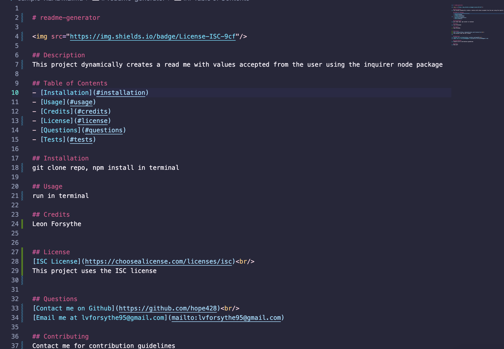
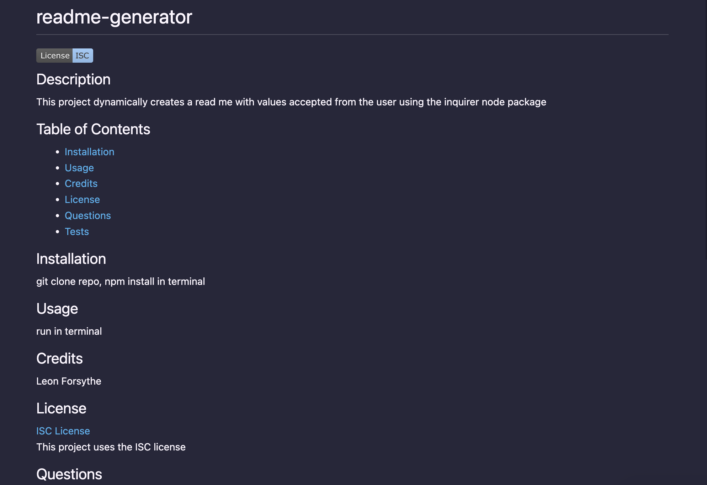

# readme-generator

## Description
This app was built with the npm inquirer package. It takes the user through a series of prompts to fill out a high-quality readme file. A sample read-me created with the generator can be found in this repo titled 'sample-README.md'

## Table of Contents
- [Installation](#installation)
- [Usage](#usage)
- [License](#license)
- [Questions](#questions)

## Installation
To install this application, git clone, then run npm install to install node packages.

## Usage 
[Link to video walkthrough](https://drive.google.com/file/d/1FWxKlr4TtveV_BsIraZ22rqCQ3hr7jQS/view) 
[Link to github repo](https://github.com/hope428/readme-generator)

## License

[MIT License](https://choosealicense.com/licenses/mit)
    

## Questions
[Contact me on Github](https://github.com/hope428) 
[Email me at lvforsythe95@gmail.com](mailto:lvforsythe95@gmail.com)

